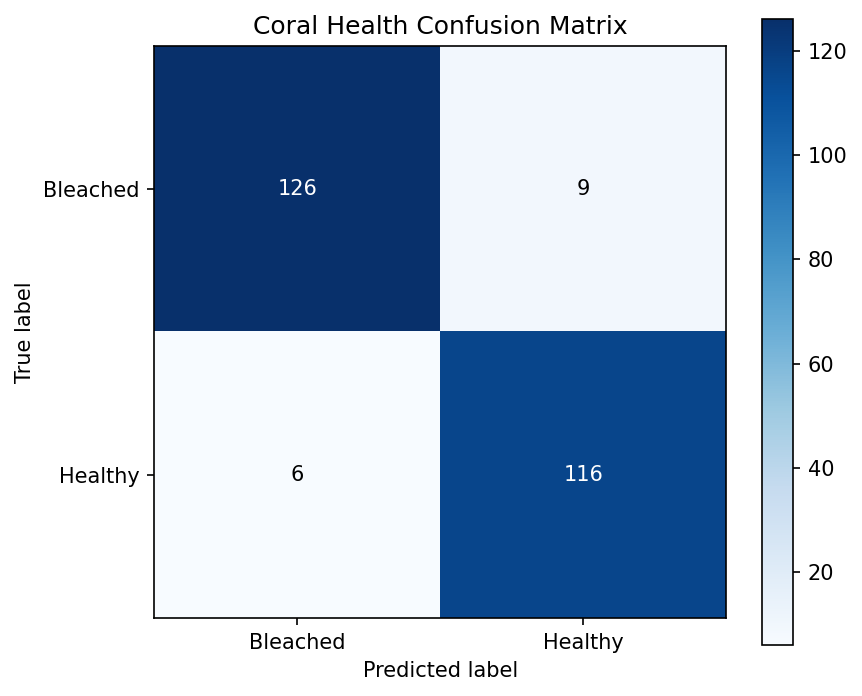

# Coral Reef Bleaching Detection

A lightweight, CPU-friendly deep learning project that classifies real underwater
coral photographs as **Healthy** or **Bleached**. It uses an ImageNet-pretrained
EfficientNetB0 model for transfer learning and provides both command-line tools and
a minimal Streamlit interface with prediction confidence.

## Project status

Local development and documentation are complete; **public deployment is the
remaining stage**.

| Area | Status |
| --- | --- |
| Dataset validation, preprocessing, and augmentation | Complete |
| EfficientNetB0 training and checkpoint selection | Complete |
| Final test evaluation and saved metrics | Complete |
| CLI inference and local Streamlit frontend | Complete |
| Formal project report | Complete: [PROJECT_REPORT.md](PROJECT_REPORT.md) |
| Docker packaging | Prepared; public container deployment not yet recorded |
| GitHub and Streamlit deployment | Deployed; anonymous access currently redirects to Streamlit sign-in |
| Dataset/code Drive links | Pending user-provided links |

`http://localhost:8501` is a local address, not a permanent public URL. It is
available only while the Streamlit process is running on the local machine.
The hosted endpoint is
[coral-reef-bleaching-detection-efficientnetb0.streamlit.app](https://coral-reef-bleaching-detection-efficientnetb0.streamlit.app/).

## Pipeline

```text
Labeled images -> resize and augment -> EfficientNetB0 transfer learning
               -> models/best_model.keras -> evaluation and prediction
               -> Streamlit upload interface
```

The evaluation command reports accuracy, precision, recall, F1-score, and a
confusion matrix.

## Final model results

The frozen-backbone EfficientNetB0 run completed 10 epochs. The best validation
checkpoint was produced by epoch 10.

| Metric | Validation | Test |
| --- | ---: | ---: |
| Loss | 0.1811 | 0.1433 |
| Accuracy | 92.22% | 94.16% |
| Macro precision | - | 94.13% |
| Macro recall | - | 94.21% |
| Macro F1-score | - | 94.15% |

The 257-image test split contains 135 Bleached and 122 Healthy images. The final
confusion matrix was `[[126, 9], [6, 116]]`, with rows representing actual
Bleached/Healthy labels and columns representing predictions.



These measurements describe the supplied dataset split. The data contains
offline augmentations and adjacent video frames, so results should not be treated
as an independent field-performance estimate until the data is regrouped and
split by original reef/site/video source.

## Project layout

```text
.
|-- dataset/
|   |-- train/{Healthy,Bleached}/
|   |-- valid/{Healthy,Bleached}/
|   `-- test/{Healthy,Bleached}/
|-- models/
|   |-- best_model.keras          # created by training
|   |-- best_model.metadata.json  # label/preprocessing contract
|   |-- evaluation_metrics.json   # created by evaluation
|   `-- confusion_matrix.png      # created by evaluation
|-- screenshots/                  # add approved UI screenshots manually
|-- src/
|   |-- config.py
|   |-- dataset_loader.py
|   |-- train.py
|   |-- evaluate.py
|   `-- predict.py
|-- app.py
|-- main.py
|-- .dockerignore
|-- .gitignore
|-- Dockerfile
|-- PROJECT_REPORT.md
|-- README.md
`-- requirements.txt
```

## Prerequisites

- A 64-bit installation of Python **3.11.x**
- `pip` and Python's `venv` module
- Enough free disk space for TensorFlow, the dataset, and the trained model
- Docker Desktop or Docker Engine only if using the container workflow

A GPU is not required. Training EfficientNetB0 on a CPU can take a while,
depending on the dataset size and processor. The first training run also needs an
internet connection if the ImageNet weights are not already cached.

## 1. Add the dataset manually

Download the [Coral Reefs Images dataset from Kaggle](https://www.kaggle.com/datasets/asfarhossainsitab/coral-reefs-images),
extract it, and arrange it inside this project as follows:

```text
dataset/
|-- train/
|   |-- Healthy/
|   `-- Bleached/
|-- valid/
|   |-- Healthy/
|   `-- Bleached/
`-- test/
    |-- Healthy/
    `-- Bleached/
```

Folder names are case-sensitive in Linux and Docker. The application never
downloads the dataset programmatically. The `dataset/` directory is excluded from
Git and Docker build contexts so the original images stay local.

## 2. Create the local environment

From the project root, create the required virtual environment named `venv`.

Windows PowerShell:

```powershell
py -3.11 -m venv venv
.\venv\Scripts\Activate.ps1
python -m pip install --upgrade pip
python -m pip install -r requirements.txt
```

macOS or Linux:

```bash
python3.11 -m venv venv
source venv/bin/activate
python -m pip install --upgrade pip
python -m pip install -r requirements.txt
```

Confirm the intended interpreter and TensorFlow installation:

```bash
python --version
python -c "import tensorflow as tf; print(tf.__version__)"
```

The expected major/minor Python version is `3.11`, and the pinned TensorFlow
version is `2.16.2`.

## 3. Train and evaluate

The simplest workflow uses the top-level command dispatcher:

```bash
python main.py train
python main.py evaluate
```

Training reads `dataset/train` and `dataset/valid`, then saves the best validation
checkpoint to `models/best_model.keras`. Evaluation loads that checkpoint and
uses `dataset/test` only.

To continue an interrupted run after one completed epoch, use:

```bash
python main.py train --resume --initial-epoch 1 --epochs 10
```

With resume mode, `--initial-epoch` is the number of epochs already completed and
`--epochs` is the final epoch target, not the number of additional epochs. The
example therefore runs epochs 2 through 10. Resume mode requires the model file
selected by `--model` to exist. It verifies the EfficientNetB0 architecture,
single-output shape, input image size, and (when present) metadata class order.
The loaded backbone remains frozen and the model is compiled with a fresh Adam
optimizer at `--learning-rate`; optimizer and callback history are not restored.

Before resumed fitting starts, the checkpoint is evaluated on the validation
split. That loss seeds both checkpointing and early stopping, so a worse resumed
epoch cannot replace the existing best model. Model metadata is written before
fitting, which also backfills the sidecar for an older interrupted checkpoint.

For explicit training controls, run the module directly:

```bash
python -m src.train --epochs 10 --batch-size 32 --learning-rate 0.001
```

Useful optional arguments include `--dataset-dir`, `--model-path`, `--weights
imagenet|none`, `--resume`, `--initial-epoch`, and `--fine-tune-epochs`. Display
all supported options with:

```bash
python -m src.train --help
python -m src.evaluate --help
```

To save the test-set confusion matrix to a chosen location:

```bash
python -m src.evaluate --confusion-matrix confusion_matrix.png
```

## 4. Predict one image

After training, classify an individual coral photograph with either entry point:

```bash
python main.py predict path/to/coral.jpg
python -m src.predict path/to/coral.jpg
```

The result includes the predicted class and confidence score. Use
`python -m src.predict --help` to see options such as a custom model path.
The displayed score is derived from the model's sigmoid output and has not been
statistically calibrated; it should not be interpreted as a guaranteed
real-world probability of correctness.

## 5. Run the Streamlit app

Make sure `models/best_model.keras` exists, then start the interface:

```bash
python main.py app
```

Equivalently:

```bash
streamlit run app.py
```

Open <http://localhost:8501>, upload a JPEG or PNG coral image, and select
**Analyze image**. The app remains available if the model is missing, but
predictions are disabled until training has produced the model artifact. Uploads
are limited to 10 MB and 25 million decoded pixels for predictable memory use.

The frontend also reads `models/evaluation_metrics.json` and presents the final
test accuracy, macro precision, macro recall, macro F1-score, sample count, and
confusion matrix in a model-performance section. These dataset-level results are
kept separate from the score for an individual upload.

The frontend screenshot is intentionally omitted pending privacy review. Add an
approved image to `screenshots/` manually before final submission. No fabricated
prediction result is included.

## 6. Deploy to Streamlit Community Cloud

The application was deployed from the `main` branch to:

<https://coral-reef-bleaching-detection-efficientnetb0.streamlit.app/>

An unauthenticated health check on 20 July 2026 was redirected to Streamlit's
login page. The deployment therefore exists but is currently access-restricted.
For anonymous demonstration access, open the app's **Settings > Sharing** page
in Streamlit Community Cloud and select the public-viewing option.

Before deployment, confirm that the inference files will be included in the
first commit:

```bash
git status --short
git check-ignore models/best_model.keras
git check-ignore models/best_model.metadata.json
```

The two `git check-ignore` commands should print nothing and return a nonzero
status. The canonical checkpoint is about 17 MB, so it does not require Git LFS
at its current size.

1. Create or select a GitHub repository, then commit and push this project to its
   `main` branch using the commands in [Git workflow](#git-workflow).
2. Open [Streamlit Community Cloud](https://share.streamlit.io), connect the
   GitHub account that can access the repository, and choose **Create app**.
3. Select the repository, branch `main`, and entry-point file `app.py`.
4. Open **Advanced settings** and explicitly select **Python 3.11**. The app does
   not currently require secrets.
5. Deploy, watch the build logs, upload a representative JPEG or PNG, and record
   the assigned `https://...streamlit.app` URL in this README and
   `PROJECT_REPORT.md`.

Community Cloud runs from the repository root, installs the pinned packages in
`requirements.txt`, reads `.streamlit/config.toml`, and needs the checked-in
`models/best_model.keras` plus its metadata file. The local `dataset/` directory
is not required for inference. See Streamlit's official guides for
[file organization](https://docs.streamlit.io/deploy/streamlit-community-cloud/deploy-your-app/file-organization),
[dependencies](https://docs.streamlit.io/deploy/streamlit-community-cloud/deploy-your-app/app-dependencies),
and [deployment](https://docs.streamlit.io/deploy/streamlit-community-cloud/deploy-your-app/deploy).

TensorFlow has a comparatively large installation and memory footprint. If the
hosted app reports a Community Cloud resource-limit error, use the Docker image
on a host with adequate memory or optimize the model for a smaller inference
runtime; do not remove the model merely to make the build pass.

## 7. Docker inference app

Train locally before building so `models/best_model.keras` is copied into the
image. The dataset itself is deliberately excluded from the image.

```bash
docker build -t coral-reef-bleaching .
docker run --rm -p 8501:8501 coral-reef-bleaching
```

Then visit <http://localhost:8501>. The container runs as an unprivileged user and
exposes Streamlit on port `8501`.

If the model is stored elsewhere locally, copy it to
`models/best_model.keras` before `docker build`.

## Notes on generated files

- The dataset and experimental model files are ignored by Git because they are
  local run artifacts.
- The canonical `models/best_model.keras` checkpoint, its metadata sidecar,
  final metrics JSON, and confusion matrix are explicitly included so a GitHub
  checkout can reproduce the documented result and run inference on Streamlit
  Community Cloud and in Docker.
- `.dockerignore` excludes the dataset but intentionally keeps model files, which
  lets the inference image contain the trained checkpoint.
- The current checkpoint is small enough for ordinary Git. If a future model
  approaches GitHub's file-size limit, migrate it to Git LFS or verified artifact
  storage and update the deployment workflow accordingly.

## Troubleshooting

- **`No module named ...`**: activate `venv` and reinstall with
  `python -m pip install -r requirements.txt`.
- **Dataset directory error**: verify every split and both class directories use
  the exact structure and capitalization shown above.
- **Model not found**: run `python main.py train` and check that
  `models/best_model.keras` was created.
- **PowerShell blocks activation**: either allow locally created scripts for the
  current process with `Set-ExecutionPolicy -Scope Process Bypass`, or call
  `venv\Scripts\python.exe` directly.
- **Docker build is slow**: TensorFlow is a large dependency; subsequent builds
  reuse the dependency layer while `requirements.txt` is unchanged.

## Git workflow

The ignore rules keep the virtual environment, dataset images, caches, and
experimental model binaries out of normal commits. The canonical inference
checkpoint and its companion artifacts are explicit exceptions and must be
committed for deployment.

```bash
git init
git add .
git commit -m "Initial project setup"
git branch -M main
git remote add origin <github-repository-url>
git push -u origin main
```

Before committing, inspect `git status --short` and ensure browser profiles,
virtual environments, dataset images, and credentials are absent. Also ensure
`models/best_model.keras`, `models/best_model.metadata.json`,
`models/evaluation_metrics.json`, and `models/confusion_matrix.png` are present.

The `main` branch is hosted at
[Rajyasri24/coral-reef-bleaching-detection](https://github.com/Rajyasri24/coral-reef-bleaching-detection)
and is connected to the Streamlit Community Cloud deployment. The current model
artifact is small enough for ordinary Git.

## Documentation and external links

| Resource | Link / status |
| --- | --- |
| Formal methodology, results, discussion, and conclusion | [PROJECT_REPORT.md](PROJECT_REPORT.md) |
| Original dataset | [Kaggle: Coral Reefs Images](https://www.kaggle.com/datasets/asfarhossainsitab/coral-reefs-images) |
| Dataset Drive link | **Pending user-provided link** |
| Source-code repository | [GitHub: Rajyasri24/coral-reef-bleaching-detection](https://github.com/Rajyasri24/coral-reef-bleaching-detection) |
| Source-code Drive link | **Pending user-provided link** |
| Streamlit application | [Hosted application](https://coral-reef-bleaching-detection-efficientnetb0.streamlit.app/) — deployed; anonymous requests currently redirect to sign-in |

## Responsible use

This model is an educational screening tool, not a substitute for marine-biologist
assessment. Predictions can be affected by lighting, water clarity, camera color
balance, coral species, and images that differ from the training dataset.
